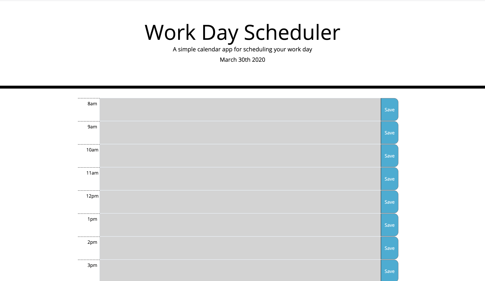

# WorkDayScheduler
Homework 5 

## Overview
A good project to practice javascript and to show what I still need to improve on. 
  
I still need practice with jquery as sometimes it became easier to use vanilla JS rather figure out JQuery.
  
I would have liked to somehow get the timeblocks built in a more efficient manner, but using bootstrap seemed like the best way to get them built. 
  
I am still having trouble with local storage. I will have to meet with a tutor to get more hands on help with that. 

I was able to connect with our TA Chris before class that helped me identify my issue with the local storage. I know I have a lot more to learn about efficiency when it comes to condensing my code and getting more comfortable with loops.
  
## Final look

